# CSS-study

Nesse estudo vamos entender como funciona o css no sentido de comportamento, a principio vamos aprender sobre flexbox.
Vou colocar a estrutura do html e vamos brincar com as posições dos elementos abaixo, então será adicionado, o css utilizado explicando
como é feito e embaixo a imagem do html,para vermos a alteração.

Por padrão vamos utilizar isso o tempo todo, o que vai mudar vai ser o css.
```html
<!DOCTYPE html>
<html lang="pt-br">
<head>
    <meta charset="UTF-8">
    <meta name="viewport" content="width=device-width, initial-scale=1.0">
    <link rel="stylesheet" href="style.css">
    <title>Document</title>
</head>
<body>
    <div class="container">
        <div class="item">1</div>
        <div class="item">2</div>
        <div class="item">3</div>
        <div class="item">4</div>
        <div class="item">5</div>
        <div class="item">6</div>
    </div>
</body>
</html>
```
Então vamos começar :

## Primeira informação importante :
- Toda div é considerada como padrão display:block ou seja os elementos vão estar sempre embaixo do outro porque o block  ele bloqueia o restante da linha

Observe a imagem abaixo:
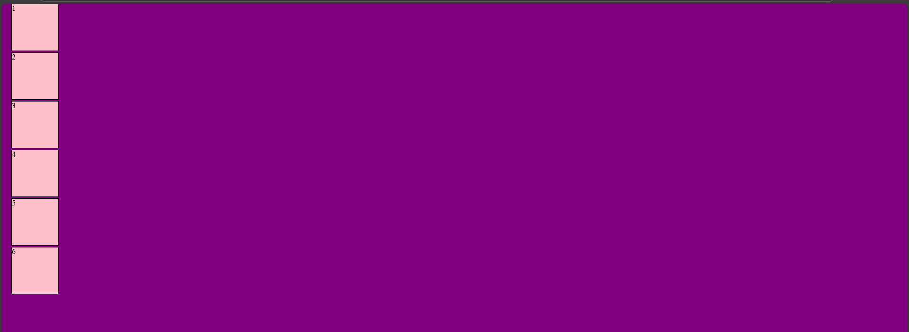

```css
*{
    margin: 0;
    padding: 0;
    box-sizing: border-box; 
}

.container {
    background-color: purple;
    height: 100vh;
    width: 100vw;
}

.item {
    width: 100px;
    height:100px;
    background-color: pink;
    border: solid 1px black;
    margin: 0px 10px 10px 10px; /*regra  up right down left */
}
```

Agora quando colocamos no container display: flex

```css
*{
    margin: 0;
    padding: 0;
    box-sizing: border-box; 
}

.container {
    background-color: purple;
    height: 100vh;
    width: 100vw;
    display: flex;
    flex-direction: row; /** default*/
}

.item {
    width: 100px;
    height:100px;
    background-color: pink;
    border: solid 1px black;
    margin: 0px 10px 10px 10px; /*regra  up right down left */
    color: blue;
    font-size: 22px;
}
```
## flex-direction : row

- que por padrão é flex-direction: row onde todos que estao dentro do container vão se comporta ficando um do lado do outro conforme imagem abaixo:

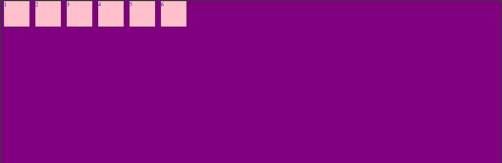

## flex-direction:column

os elementos ficam um embaixo do outro:

```css
*{
    margin: 0;
    padding: 0;
    box-sizing: border-box; 
}

.container {
    background-color: purple;
    height: 100vh;
    width: 100vw;
    display: flex;
    flex-direction: column;
}

.item {
    width: 100px;
    height:100px;
    background-color: pink;
    border: solid 1px black;
    margin: 0px 10px 10px 10px; /*regra  up right down left */
    color: blue;
    font-size: 22px;
}
```
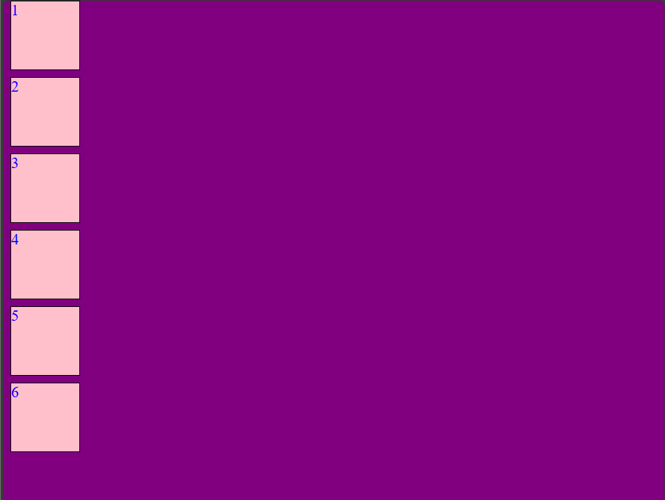

## flex-direction:reverse

os elementos ficam em linha em posiçoes contrarias:

```css
    *{
    margin: 0;
    padding: 0;
    box-sizing: border-box; 
}

.container {
    background-color: purple;
    height: 100vh;
    width: 100vw;
    display: flex;
    flex-direction: row-reverse;
}

.item {
    width: 100px;
    height:100px;
    background-color: pink;
    border: solid 1px black;
    margin: 0px 10px 10px 10px; /*regra  up right down left */
    color: blue;
    font-size: 22px;
}
```
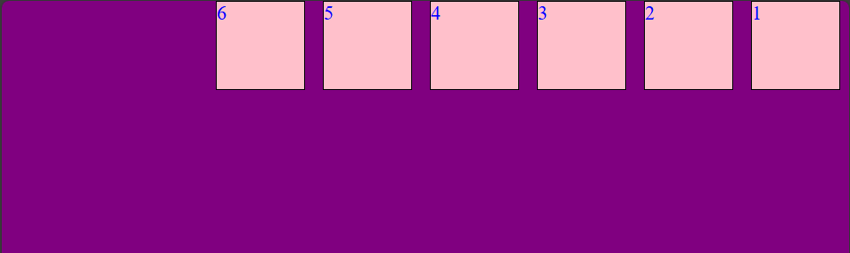

## flex-direction:column-reverse

```css
*{
    margin: 0;
    padding: 0;
    box-sizing: border-box; 
}

.container {
    background-color: purple;
    height: 100vh;
    width: 100vw;
    display: flex;
    flex-direction: column-reverse;
}

.item {
    width: 100px;
    height:100px;
    background-color: pink;
    border: solid 1px black;
    margin: 0px 10px 10px 10px; /*regra  up right down left */
    color: blue;
    font-size: 22px;
}
```
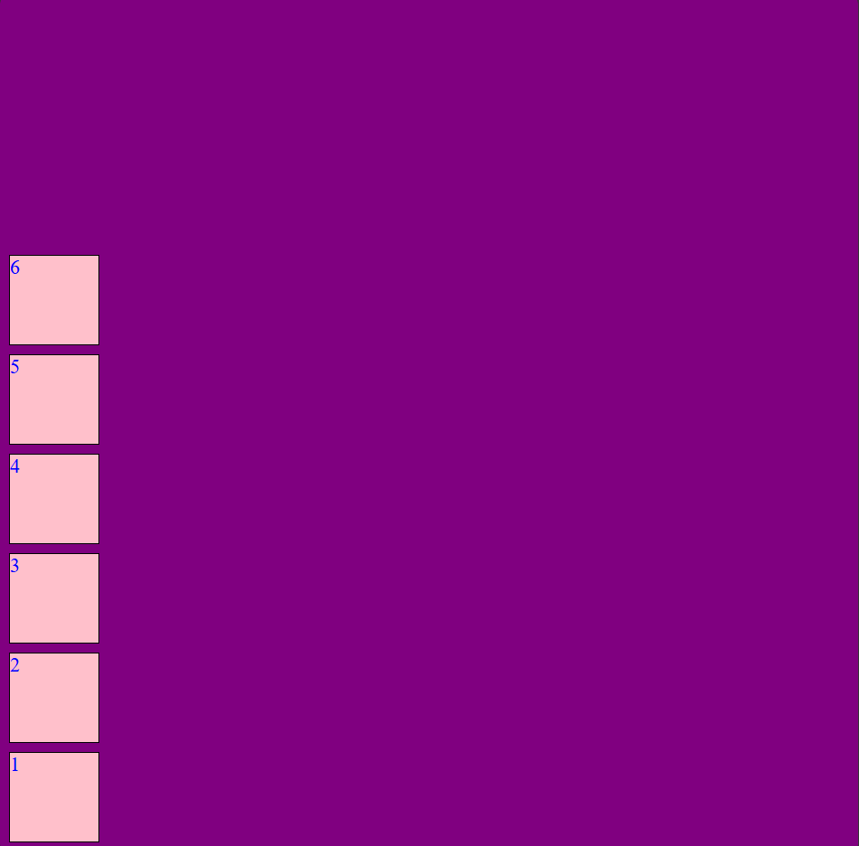

## flex- wrap

- Por padrão o flex-wrap:nowrap, o que isso quer dizer que se um elemento for maior que o pai, ele nao vai quebrar o pai, ele tem que comportar dentro do pai, nao tem para onde ele crescer

## flex-wrap:nowrap 

- agora vamos definir um tamanho do container e acrescentar um tamanho para os filhos

```css
*{
    margin: 0;
    padding: 0;
    box-sizing: border-box; 
}

.container {
    background-color: purple;
    height: 1000px;
    width: 1000px;
    display: flex;
    flex-wrap: nowrap;
}

.item {
    width: 500px;
    height:500px;
    background-color: pink;
    border: solid 1px black;
    margin: 0px 10px 10px 10px; /*regra  up right down left */
    color: blue;
    font-size: 22px;
}
```
Observe que mesmo com o item maior que o pai pela quantidade, ele respeitou o tamanho do pai,vamos ver o que acontece quando usamos o wrap.
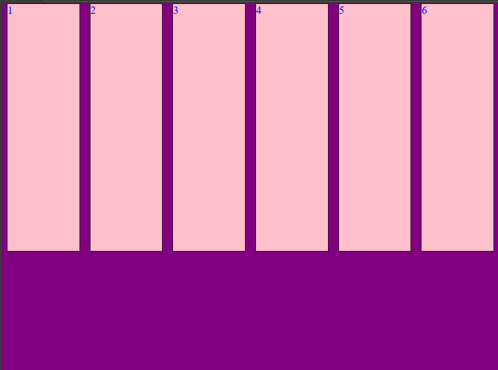


## flex-wrap:wrap 

- Com essa condição ele desobedece o pai e aumenta o tamanho do elemento, filho rebelde.

```css
*{
    margin: 0;
    padding: 0;
    box-sizing: border-box; 
}

.container {
    background-color: purple;
    height: 1000px;
    width: 1000px;
    display: flex;
    flex-wrap: wrap;
}

.item {
    width: 500px;
    height:500px;
    background-color: pink;
    border: solid 1px black;
    margin: 0px 10px 10px 10px; /*regra  up right down left */
    color: blue;
    font-size: 22px;
}    
```

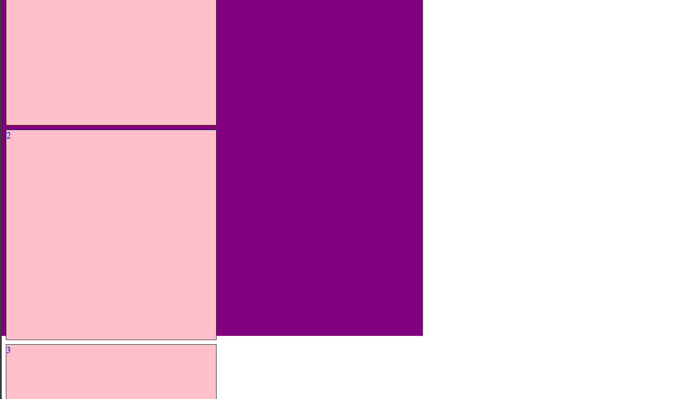

## flex-wrap:wrap-reverse

- Também desobedece a ordem do pai e cresce reversamente

```css
*{
    margin: 0;
    padding: 0;
    box-sizing: border-box; 
}

.container {
    background-color: purple;
    height: 1000px;
    width: 1000px;
    display: flex;
    flex-wrap: wrap-reverse;
}

.item {
    width: 500px;
    height:500px;
    background-color: pink;
    border: solid 1px black;
    margin: 0px 10px 10px 10px; /*regra  up right down left */
    color: blue;
    font-size: 22px;
}
```
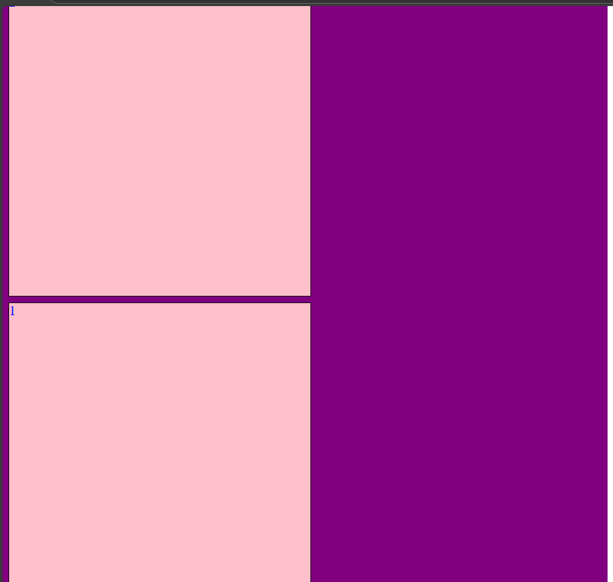

## flex-flow
- basicamente flex flow é um atalho onde pode unir flex-direction com flex-wrap

```css
*{
    margin: 0;
    padding: 0;
    box-sizing: border-box; 
}

.container {
    background-color: purple;
    height: 1000px;
    width: 1000px;
    display: flex;
    flex-flow: column wrap;
}

.item {
    width: 500px;
    height:500px;
    background-color: pink;
    border: solid 1px black;
    margin: 0px 10px 10px 10px; /*regra  up right down left */
    color: blue;
    font-size: 22px;
}
```

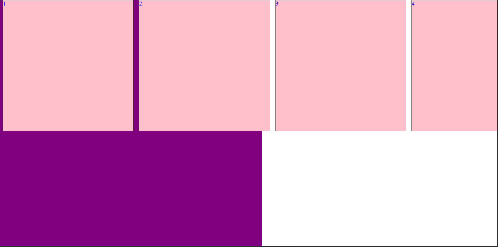

## justify-content

O justify-content permite a forma que organizamos os elementos dentro do container.
Um outro detalhe é que o justify-content vai se comportar de acordo com o seu flex-direction
caso for row vai trabalhar na horizontal, caso column na vertical
vamos ver alguns exemplos

## justify-content: center

```css
*{
    margin: 0;
    padding: 0;
    box-sizing: border-box; 
}

.container {
    background-color: purple;
    height: 100vh;
    width: 100vw;
    display: flex;
    justify-content: center;

}

.item {
    width: 50px;
    height:50px;
    background-color: pink;
    border: solid 1px black;
    margin: 0px 10px 10px 10px; /*regra  up right down left */
    color: blue;
    font-size: 22px;
}
```

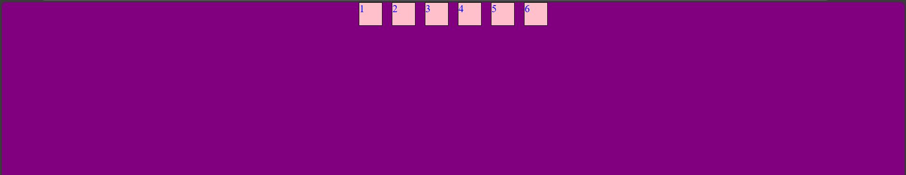

## justify-content:flex-start

```css
*{
    margin: 0;
    padding: 0;
    box-sizing: border-box; 
}

.container {
    background-color: purple;
    height: 100vh;
    width: 100vw;
    display: flex;
    justify-content: flex-start;

}

.item {
    width: 50px;
    height:50px;
    background-color: pink;
    border: solid 1px black;
    margin: 0px 10px 10px 10px; /*regra  up right down left */
    color: blue;
    font-size: 22px;
}
```


## justify-content:flex-end

```css
*{
    margin: 0;
    padding: 0;
    box-sizing: border-box; 
}

.container {
    background-color: purple;
    height: 100vh;
    width: 100vw;
    display: flex;
    justify-content: flex-end;

}

.item {
    width: 50px;
    height:50px;
    background-color: pink;
    border: solid 1px black;
    margin: 0px 10px 10px 10px; /*regra  up right down left */
    color: blue;
    font-size: 22px;
}
```
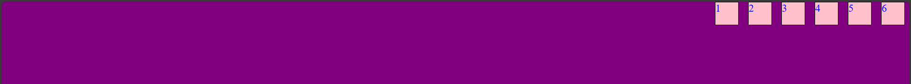

## flex direction: column com justify-content: center

```css
*{
    margin: 0;
    padding: 0;
    box-sizing: border-box; 
}

.container {
    background-color: purple;
    height: 100vh;
    width: 100vw;
    display: flex;
    flex-direction: column;
    justify-content: center;

}

.item {
    width: 50px;
    height:50px;
    background-color: pink;
    border: solid 1px black;
    margin: 0px 10px 10px 10px; /*regra  up right down left */
    color: blue;
    font-size: 22px;
}
```
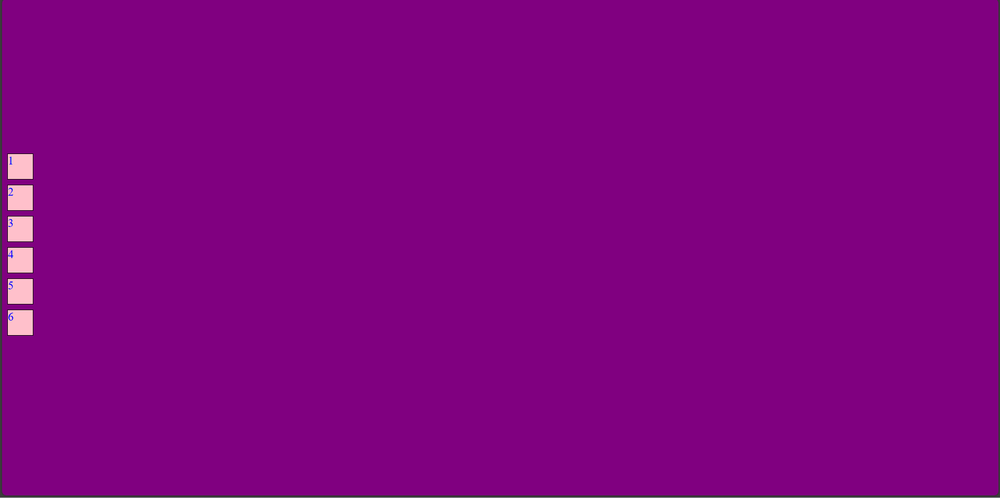

## flex direction: column com justify-content: flex-start

```css
*{
    margin: 0;
    padding: 0;
    box-sizing: border-box; 
}

.container {
    background-color: purple;
    height: 100vh;
    width: 100vw;
    display: flex;
    flex-direction: column;
    justify-content: flex-start;

}

.item {
    width: 50px;
    height:50px;
    background-color: pink;
    border: solid 1px black;
    margin: 0px 10px 10px 10px; /*regra  up right down left */
    color: blue;
    font-size: 22px;
}
```


## flex direction: column com justify-content: flex-end

```css
*{
    margin: 0;
    padding: 0;
    box-sizing: border-box; 
}

.container {
    background-color: purple;
    height: 100vh;
    width: 100vw;
    display: flex;
    flex-direction: column;
    justify-content: flex-end;

}

.item {
    width: 50px;
    height:50px;
    background-color: pink;
    border: solid 1px black;
    margin: 0px 10px 10px 10px; /*regra  up right down left */
    color: blue;
    font-size: 22px;
}
```
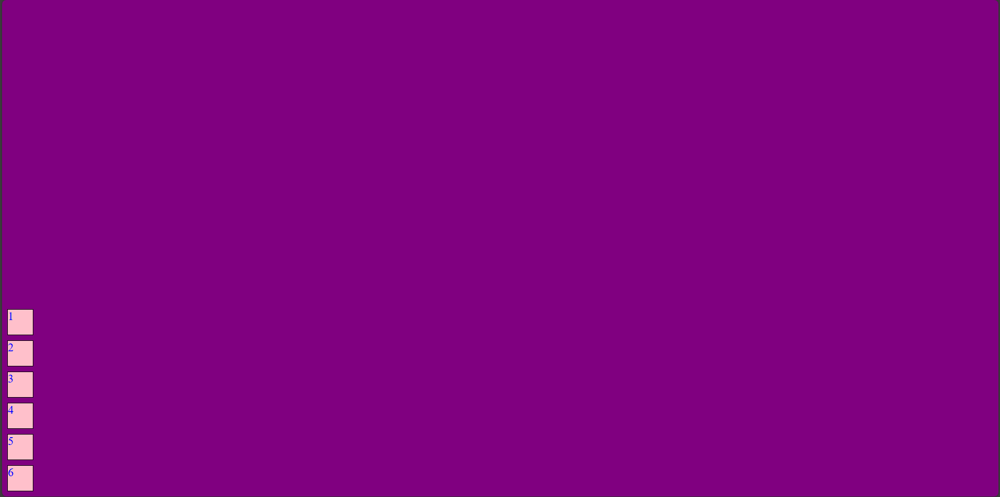

## justify-content:space-around

- contém espaço antes e entre e depois dos elementos

```css
*{
    margin: 0;
    padding: 0;
    box-sizing: border-box; 
}

.container {
    background-color: purple;
    height: 100vh;
    width: 100vw;
    display: flex;
    justify-content: space-around;

}

.item {
    width: 50px;
    height:50px;
    background-color: pink;
    border: solid 1px black;
    margin: 0px 10px 10px 10px; /*regra  up right down left */
    color: blue;
    font-size: 22px;
}
```

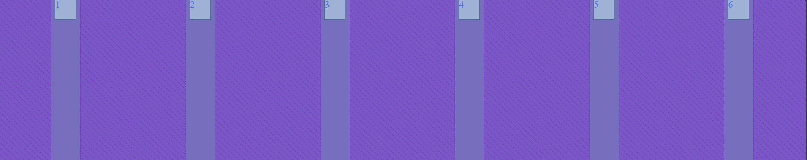

## justify-content:space-between

- Com space-between nao há espaços nas extermidades.
- Todo espaço fica livre entre os itens.
- Primeiro item encosta no inicio.
- Ultimo item encosta no fim.

```css
*{
    margin: 0;
    padding: 0;
    box-sizing: border-box; 
}

.container {
    background-color: purple;
    height: 100vh;
    width: 100vw;
    display: flex;
    justify-content: space-between;

}

.item {
    width: 50px;
    height:50px;
    background-color: pink;
    border: solid 1px black;
    margin: 0px 10px 10px 10px; /*regra  up right down left */
    color: blue;
    font-size: 22px;
}
```
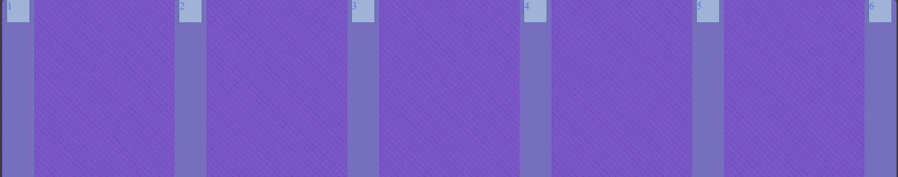

## justify-content:space-evenly

-Todo espaço é dividido de forma igual para todos os itens

```css
*{
    margin: 0;
    padding: 0;
    box-sizing: border-box; 
}

.container {
    background-color: purple;
    height: 100vh;
    width: 100vw;
    display: flex;
    justify-content: space-evenly;

}

.item {
    width: 50px;
    height:50px;
    background-color: pink;
    border: solid 1px black;
    margin: 0px 10px 10px 10px; /*regra  up right down left */
    color: blue;
    font-size: 22px;
}
```
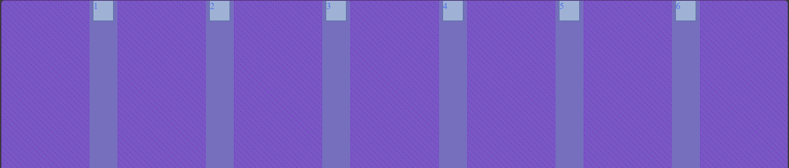

Agora vamos aprender sobre o align-items que vamos mexer no eixo secundario, por exemplo
quando temos um flex-direction: row estamos trabalhando  com o eixo horizontal, e quando usamos o align-items vamos mexer nmo vertical
Então fica dessa forma:
flex-direction:row eixo principal horizontal, eixo secundario vertical.
flex-direction:column eixo principal vertical, eixo secundario horizontal.
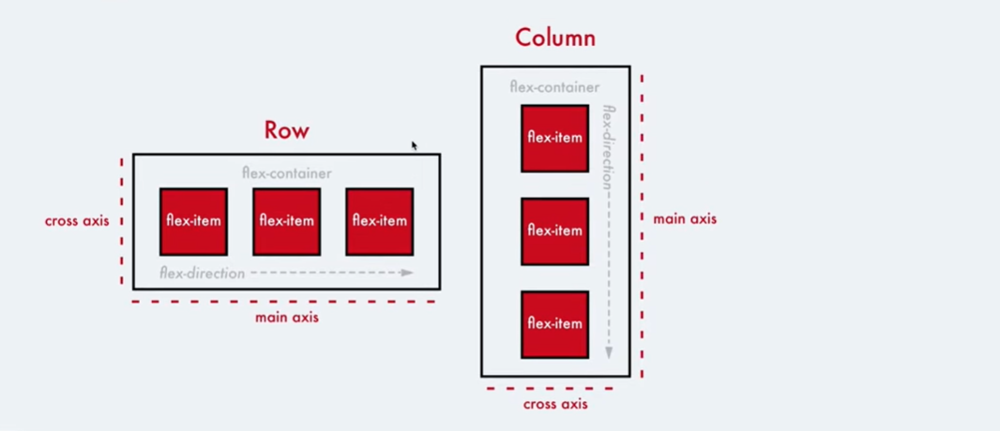
Mas vamos ver isso na pratica:

## flex direction:row com justify-content:center e align-items:center

```css
*{
    margin: 0;
    padding: 0;
    box-sizing: border-box; 
}

.container {
    background-color: purple;
    height: 100vh;
    width: 100vw;
    display: flex;
    justify-content: center;
    align-items: center;

}

.item {
    width: 50px;
    height:50px;
    background-color: pink;
    border: solid 1px black;
    margin: 0px 10px 10px 10px; /*regra  up right down left */
    color: blue;
    font-size: 22px;
}
```


## flex direction:row com justify-content:center e align-items:flex-start

```css
*{
    margin: 0;
    padding: 0;
    box-sizing: border-box; 
}

.container {
    background-color: purple;
    height: 100vh;
    width: 100vw;
    display: flex;
    justify-content: center;
    align-items: flex-start;

}

.item {
    width: 50px;
    height:50px;
    background-color: pink;
    border: solid 1px black;
    margin: 0px 10px 10px 10px; /*regra  up right down left */
    color: blue;
    font-size: 22px;
}
```
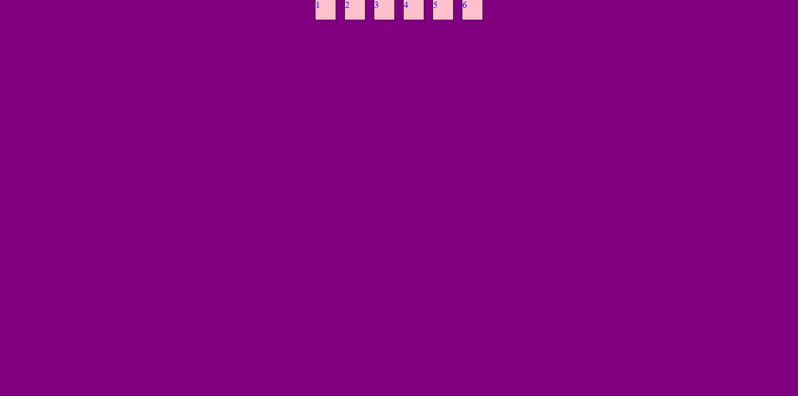

## flex direction:row com justify-content:center e align-items:flex-end

```css
*{
    margin: 0;
    padding: 0;
    box-sizing: border-box; 
}

.container {
    background-color: purple;
    height: 100vh;
    width: 100vw;
    display: flex;
    justify-content: center;
    align-items: flex-end;

}

.item {
    width: 50px;
    height:50px;
    background-color: pink;
    border: solid 1px black;
    margin: 0px 10px 10px 10px; /*regra  up right down left */
    color: blue;
    font-size: 22px;
}
```
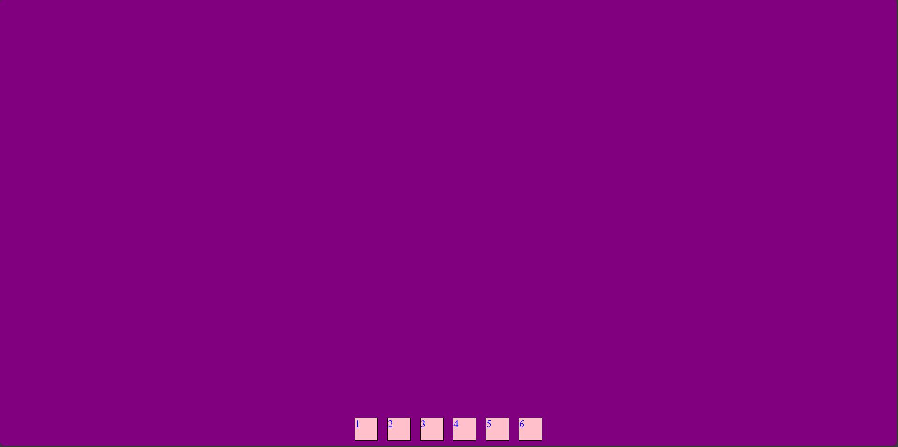

Agora vamos fazer com o flex-direction:column

## flex direction:column com justify-content:center e align-items:center

```css
*{
    margin: 0;
    padding: 0;
    box-sizing: border-box; 
}

.container {
    background-color: purple;
    height: 100vh;
    width: 100vw;
    display: flex;
    flex-direction: column;
    justify-content: center;
    align-items: center;

}

.item {
    width: 50px;
    height:50px;
    background-color: pink;
    border: solid 1px black;
    margin: 0px 10px 10px 10px; /*regra  up right down left */
    color: blue;
    font-size: 22px;
}
```


## flex direction:column com justify-content:center e align-items:flex-start

```css
*{
    margin: 0;
    padding: 0;
    box-sizing: border-box; 
}

.container {
    background-color: purple;
    height: 100vh;
    width: 100vw;
    display: flex;
    flex-direction: column;
    justify-content: center;
    align-items: flex-start;

}

.item {
    width: 50px;
    height:50px;
    background-color: pink;
    border: solid 1px black;
    margin: 0px 10px 10px 10px; /*regra  up right down left */
    color: blue;
    font-size: 22px;
}
```
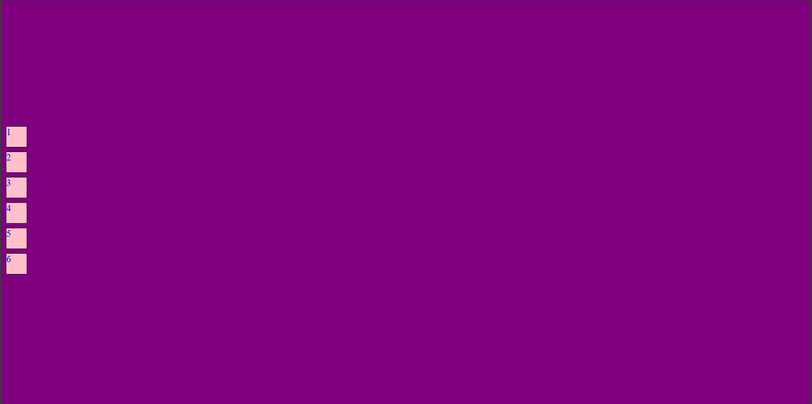

## flex direction:column com justify-content:center e align-items:flex-end

```css
*{
    margin: 0;
    padding: 0;
    box-sizing: border-box; 
}

.container {
    background-color: purple;
    height: 100vh;
    width: 100vw;
    display: flex;
    flex-direction: column;
    justify-content: center;
    align-items: flex-end;

}

.item {
    width: 50px;
    height:50px;
    background-color: pink;
    border: solid 1px black;
    margin: 0px 10px 10px 10px; /*regra  up right down left */
    color: blue;
    font-size: 22px;
}
```


## flex direction:column com justify-content:center e align-items:stretch

- Quando utilizamos o stretch,desde que os itens não tem um height definido, ele estica até ocupar o espaço no seu eixo cruzado

```css
    *{
    margin: 0;
    padding: 0;
    box-sizing: border-box; 
}

.container {
    background-color: purple;
    height: 100vh;
    width: 100vw;
    display: flex;
    flex-direction: column;
    justify-content: center; 
    align-items: stretch;

}

.item {
    /* width: 50px; */
    /* height:50px; */
    background-color: pink;
    border: solid 1px black;
    margin: 0px 10px 10px 10px; /*regra  up right down left */
    color: blue;
    font-size: 22px;
}
```

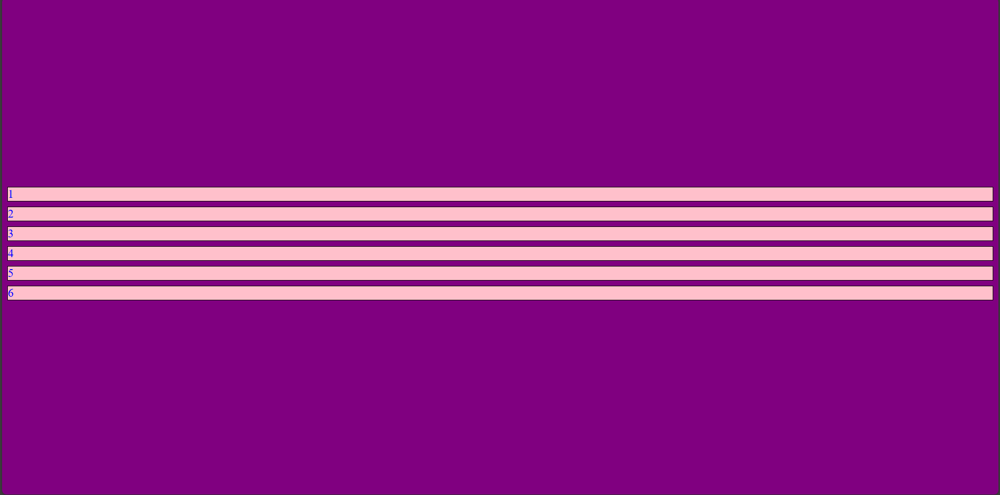

## align-content 

Com align-content ele agrupa os conteudos e posiciona todo mundo para o local,vou fazer um exemplo onde usamos o align-items e align-content para vermos a diferença

## com align-items 

```css
*{
    margin: 0;
    padding: 0;
    box-sizing: border-box; 
}

.container {
    background-color: purple;
    height: 600px;
    width: 600px;
    display: flex;
    flex-wrap: wrap;
    justify-content: center; 
    align-items: center;
}

.item {
    width: 150px;
    height:150px;
    background-color: pink;
    border: solid 1px black;
    margin: 0px 10px 10px 10px; /*regra  up right down left */
    color: blue;
    font-size: 22px;
}
```
Observe que na imagem ele está com um espaçamento maior, pois ele nçao conseguiu colocar todo mundo no centro devido o seu tamanho.

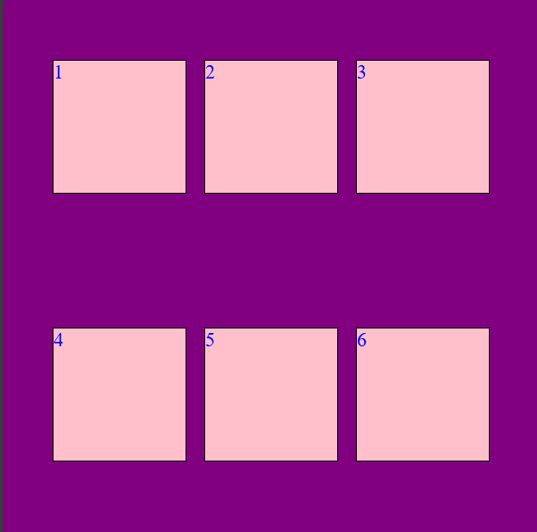

Agora vamos ver como se comporta com o align-content

```css
*{
    margin: 0;
    padding: 0;
    box-sizing: border-box; 
}

.container {
    background-color: purple;
    height: 600px;
    width: 600px;
    display: flex;
    flex-wrap: wrap;
    justify-content: center; 
    align-content: center;
}

.item {
    width: 150px;
    height:150px;
    background-color: pink;
    border: solid 1px black;
    margin: 0px 10px 10px 10px; /*regra  up right down left */
    color: blue;
    font-size: 22px;
}
```
Consegue ver a diferença entre os dois ?
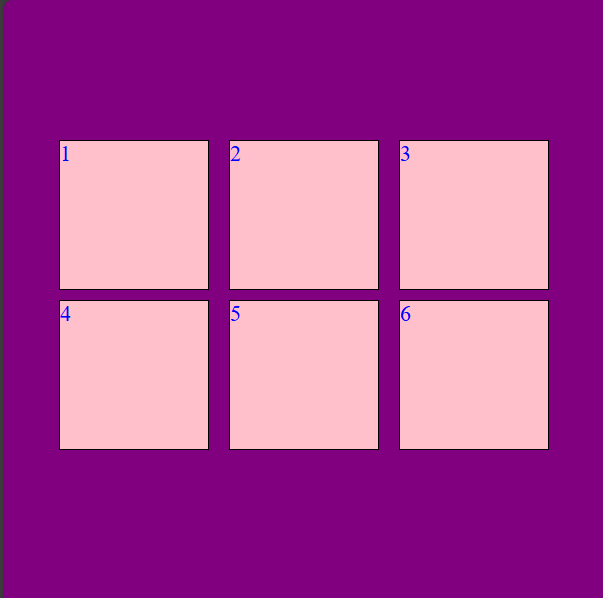

um outro exemplo posicionando o elemento abaixo

```css
*{
    margin: 0;
    padding: 0;
    box-sizing: border-box; 
}

.container {
    background-color: purple;
    height: 600px;
    width: 600px;
    display: flex;
    flex-wrap: wrap;
    justify-content: center; 
    align-content: flex-end;
}

.item {
    width: 150px;
    height:150px;
    background-color: pink;
    border: solid 1px black;
    margin: 0px 10px 10px 10px; /*regra  up right down left */
    color: blue;
    font-size: 22px;
}
```
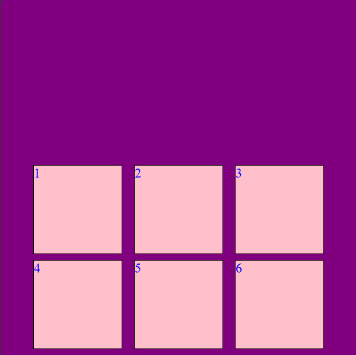

## gap

Basicamente ele cria um espaçamento entre todos os elementos

sem gap

```css
*{
    margin: 0;
    padding: 0;
    box-sizing: border-box; 
}

.container {
    background-color: purple;
    height: 100vh;
    width: 100vw;
    display: flex;
    justify-content: center; 
    align-items: center;

}

.item {
    width: 150px;
    height:150px;
    background-color: pink;
    border: solid 1px black;
    margin: 0px 10px 10px 10px; /*regra  up right down left */
    color: blue;
    font-size: 22px;
}
```

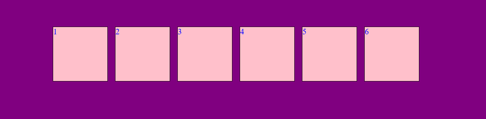

com gap

```css
*{
    margin: 0;
    padding: 0;
    box-sizing: border-box; 
}

.container {
    background-color: purple;
    height: 100vh;
    width: 100vw;
    display: flex;
    justify-content: center; 
    align-items: center;
    gap: 30px;
}

.item {
    width: 150px;
    height:150px;
    background-color: pink;
    border: solid 1px black;
    margin: 0px 10px 10px 10px; /*regra  up right down left */
    color: blue;
    font-size: 22px;
}
```
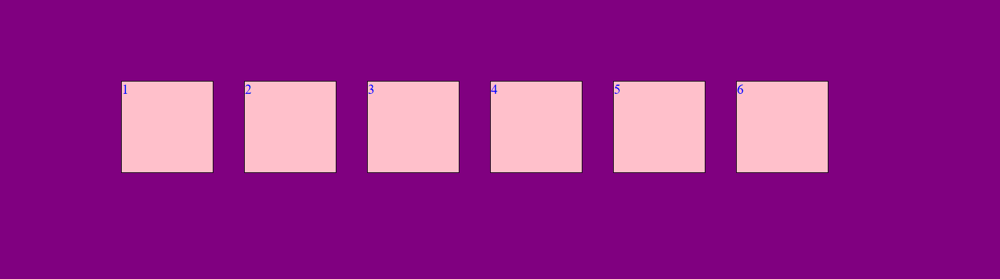
consegue olhar a diferença? 